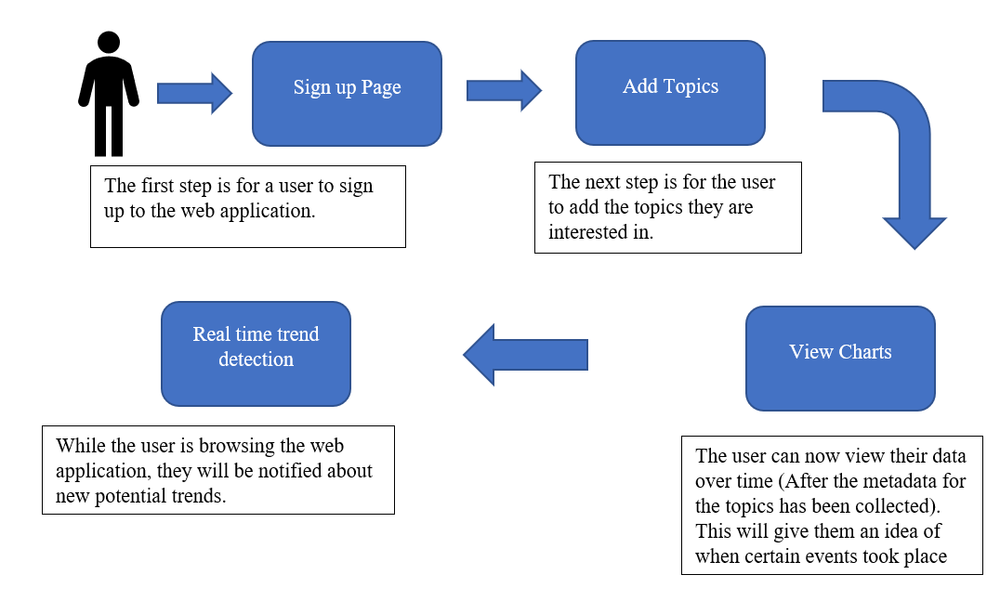
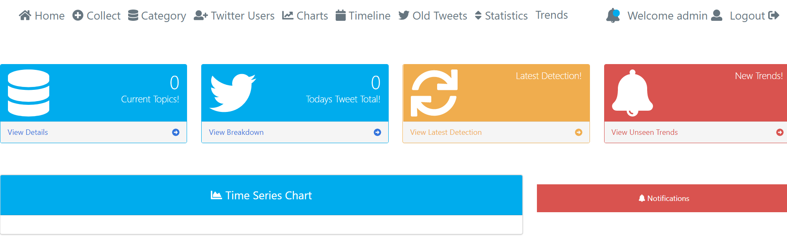
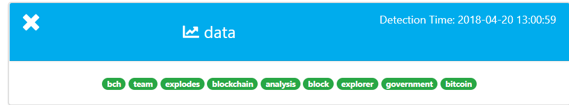
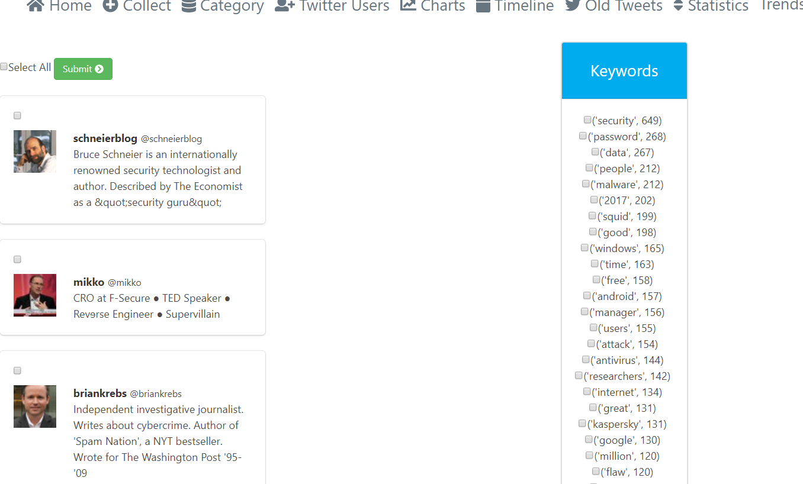
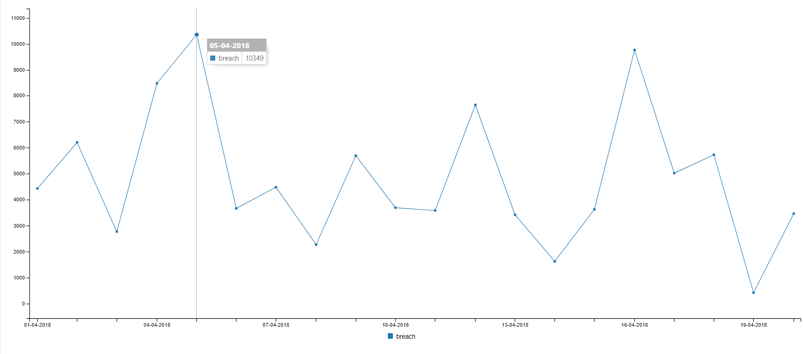
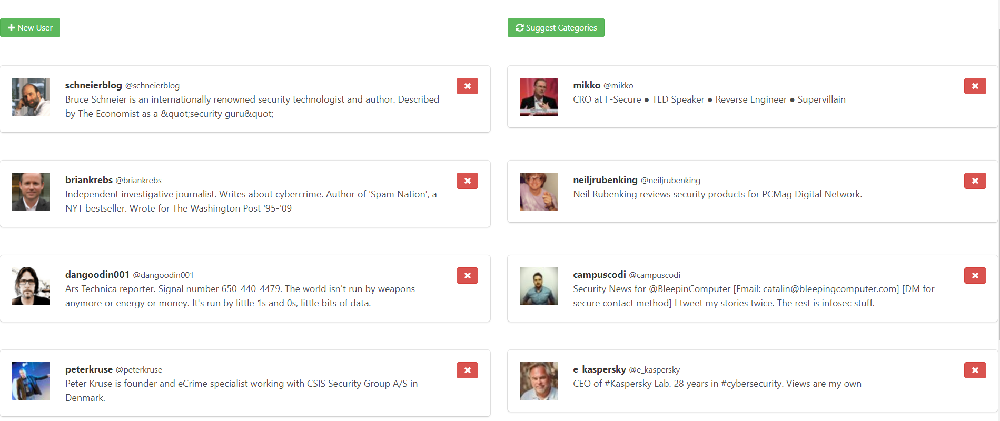

# Semi-Autonomous Trend Detection Using Real-Time Twitter Data 

The way Twitter has done trends is fantastic for what they are trying to achieve. However, it has some drawbacks. Twitter breaks it down into 3 different categories: global trends, local trends, and tailored trends. Each of these categories has only the 10 most popular trends for that given time. It is important to talk about how the tailored trends work because that is what this project is closely based off. The aim of tailored trends is to give trends based on your location and who you follow. This causes a problem when you may not be interested in a lot of the topics that the people you are following are interested in e.g. You follow a person for their opinion on football, but they also tweet a lot about fishing which you have no interest in. This makes it so that a lot of the tailored trends that are being detected are not relevant to you. 
Another issue with the way Twitter does trends is the fact it only has 10 entries and isn’t followed over time. Following a story over time can lead to a more accurate representation of what it is that is going on.

The idea behind this project is to develop a web application which a user can use to detect trends on the topics they are interested in. The web app will work in a semi-autonomous way where it will do detection of trends in the background. It will detect trends in real time. The trend can be monitored over time and isn’t removed until the user wants it removed. This opens the usefulness open to a much different category of people. 
Some of the features of the web application include:
1.	Semi-Autonomous trend detection on real time Twitter data.
2.	Adding the topics to detect trends for based on the user’s preference. 
3.	Adding followers/Twitter users to detect topics that you may wish to include. A user of the web application can add Twitter users that they are interested in to help with picking the right topics for them. This feature will report back a list of potential topics which can then be added/declined.
4.	Collect old tweets based on a topic to detect what some of the keywords on a topic were. An example of this would be to collect tweets on ‘youtube’ after it has had an outage. This feature will return the most popular words based on this, which may be: ‘down’, ‘outage’, or ‘hacked’. This gives a user a suggestion on what topics may be useful to get a broad range of trends e.g. outage would be a good topic to include if you were interested in telling when websites go down.
5.	Table views. This is a table view of the data that has been collected over time with the potential trends displayed in red. The table can be changed based on the topic you want.
6.	Display information on charts. The charts that are currently supported are: spline, line, bar, area, and area spline.

# Sample Use Case

# Sample Images

## Dashboard

## Trend Found

## Keyword Collection

## Graph

## User list

# Setup

Setup for this project is relatively simple. It can be setup on any operating system that has Python3 installed. In this section, it will go through a sample installation using a Google Cloud Engine Instance. The first step for installation is to pull the project from the existing Github repository.

        git pull  https://github.com/dannyoleary1/Final-year-project---Twitter-Analysis-using-Machine-Learning
        
The next step involves setting up a virtual environment. This step is important so that the dependencies of this project can stay separate from the ones stored on the machine. This can potentially become an issue when using different versions. An example of where this happens is if you downloaded this project which uses Django 2.0. Later, you want to update the version of Django to 3.0 (Django 2.0 is the latest at time of writing) and this in turn breaks this project. By installing it with a virtual environment, it ensures Django 2.0 will always be used. The first step of installing a virtual environment is to run the install command from the root directory of the project:

`sudo pip3 install virtualenv`

Next step is to activate the virtual environment:

`source Final-year-project---Twitter-Analysis-using-Machine-Learning/bin/activate`

Now that the virtual environment is installed, it is possible to install all the dependencies that are needed for the project. The requirements.txt contains a list of all the dependencies that are needed by the project:

`pip3 install -r requirements.txt`

Now that all the dependencies are installed, the last steps are setting some of these dependencies up. The first that needs to be done is redis-server. This is needed for Django Channels which is dealing with sending live notifications to the user, and it’s also needed for Celery which is dealing with background tasks.
redis-server
Next up to run is the Celery workers. The celery workers are used for asynchronous background tasks, and the amount set for the concurrency here can vary on the expected amount of traffic. The concurrency parameter sets up a new thread on the machine for parallel processing. There’s 4 different Celery workers that need to be setup:
1.	Default: The default Celery worker is responsible for collecting tweets live and processing them to the relevant Elasticsearch index.
2.	Misc: The misc Celery worker is responsible for running the notifications background task which sends notifications about the latest trends to the user. It runs tasks based on a schedule. One runs every 5 minutes (To detect real time trends), and one at midnight to purge the latest index.
3.	Priority_high: The priority_high Celery worker is responsible for page loads in an asynchronous matter. It shows a loading page until completion and then displayed the actual content. This takes priority over the other queues.
4.	Old_tweets: The old_tweets Celery worked is responsible for collecting old tweets for a specific instance when added or ran individually.
To be ran from the /fyp folder

`nohup celery -A fyp worker –concurrency=15 -Q default -n “default”& > default.out&`

`nohup celery -A fyp worker –concurrency=4 -Q misc -n “misc”& > misc.out&`

`nohup celery -A fyp worker –concurrency=4 -Q priority_high -n “priority_high”& > priority.out&`

`nohup celery -A fyp worker –concurrency=4 -Q old_tweets -n ”old_tweets”&>old.out&`

`nohup celery -A fyp beat &`

Note that nohup is used to keep the commands running outside of SSH and the logs are being outputted to separate files. The last command is responsible for letting Celery know about the schedule.
The last thing that needs to be setup is the server itself. From the root of the project, the settings file needs to be configured:

`cd fyp`

`nano settings.py`

Inside the settings file should be a list called ALLOWED_HOSTS

The IP address of the instance needs to be entered in here. After this, the project is now runnable. From the fyp folder run:

`python3 manage.py runserver 0.0.0.0:8000`

Now all that needs to be done is that a topic needs to be added, and the application will automatically start to detect trends.

